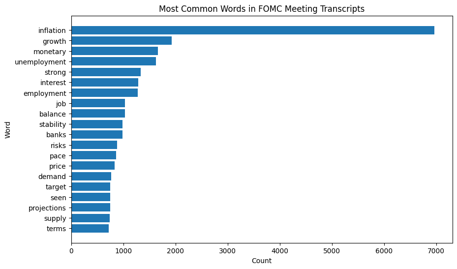
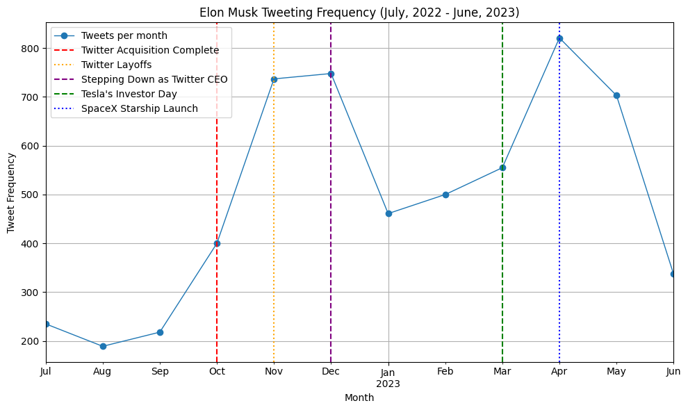

# Natural Language Processing


NLP projects covering the full text pipeline — **collection → cleaning → representation →
modelling → interpretation** — from financial-speech sentiment to social-media topic modelling.

**Techniques:** web scraping (Selenium) · tokenisation & lemmatisation (NLTK) · **TF-IDF** ·
domain-specific sentiment with **FinBERT** · rule-based sentiment (**VADER**) · topic modelling
with **Latent Dirichlet Allocation** (gensim) · LLM-assisted topic labelling (Ollama / Llama 3)

---

### 01 · Fed-Speech Sentiment (FOMC)


- **Data** — 128 FOMC press-conference videos (2017–2024) scraped with **Selenium**; transcripts via the YouTube API.
- **Methods** — cleaning (NLTK), TF-IDF, and **FinBERT** for financial-domain sentiment.
- **Result** — "inflation" (6,960) dominates Fed discourse; employment/inflation passages carry the most positive tone.

📓 [Notebook](01-fomc-fed-sentiment/fomc_nlp_sentiment.ipynb) · [nbviewer](https://nbviewer.org/github/jamie-dongjae/natural-language-processing/blob/main/01-fomc-fed-sentiment/fomc_nlp_sentiment.ipynb)

### 02 · Tweet Topic Modelling & Sentiment


- **Data** — ~5,900 tweets (Jul 2022 – Jun 2023).
- **Methods** — preprocessing + lemmatisation, **LDA** (gensim, 10 topics), **VADER** sentiment, and a local LLM (**Ollama / Llama 3**) to turn topic-term lists into readable labels.
- **Result** — tweet volume tracks major business events (Twitter acquisition, layoffs, Tesla/SpaceX milestones — annotated above).

📓 [Notebook](02-tweet-topic-modeling/tweets_topic_modeling.ipynb) · [nbviewer](https://nbviewer.org/github/jamie-dongjae/natural-language-processing/blob/main/02-tweet-topic-modeling/tweets_topic_modeling.ipynb)

---

## Tech stack
**Python** · NLTK · gensim · HuggingFace Transformers (FinBERT) · vaderSentiment · Selenium · scikit-learn · Matplotlib · Seaborn · Ollama

## Run locally
```bash
python3 -m venv .venv && source .venv/bin/activate
pip install -r requirements.txt
jupyter lab
```

## More of my work
`Machine learning:` [supervised-machine-learning](https://github.com/jamie-dongjae/supervised-machine-learning) · [time-series-forecasting](https://github.com/jamie-dongjae/time-series-forecasting) · [unsupervised-and-causal-inference](https://github.com/jamie-dongjae/unsupervised-and-causal-inference)
`Capstone:` [Dream Space — Digital-Literacy Platform](https://github.com/jamie-dongjae/dream-space-digital-literacy-platform)

---
*Jamie Lee · BSc Computational Social Science, University of Amsterdam (2024–25)*
